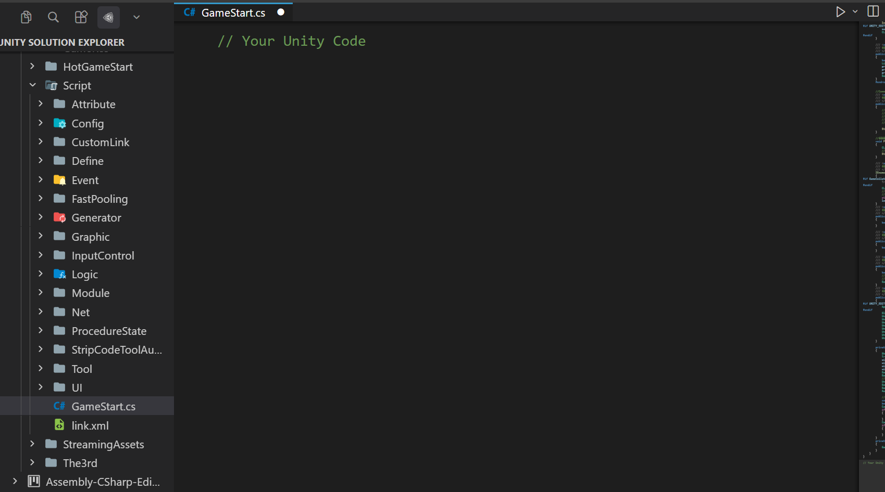

# Unity Solution Explorer

在 Cursor / VSCode 侧边栏按 .sln 和 .csproj 展示 Unity 解决方案与程序集结构（如 Assembly-CSharp、Assembly-CSharp-Editor），自动忽略非 Unity 编辑文件，并支持多种资源文件的展示与右键操作。

## Screenshot / 界面预览

## English

Browse Unity .sln and .csproj in the sidebar (Cursor / VS Code). Shows solution and assembly structure (e.g. Assembly-CSharp, Assembly-CSharp-Editor), automatically ignores non-Unity editor files, and supports multiple file types with right-click actions.

**Install:** Extensions view -> ... -> Install from VSIX -> choose unity-solution-explorer-*.vsix. Or install from the extension marketplace (Open VSX). Reload and open a Unity project with .sln to use.

**Settings:** Search "Unity Solution Explorer" in Settings to configure Exclude Projects.

---

## 功能概览

- **解决方案树**：自动发现 .sln，按程序集展示；支持排除指定项目。自动忽略非 Unity 编辑文件。
- **多类型文件**：除 .cs 外，展示 .shader、.xml、.txt、.json（由 .csproj 的 Compile/None/Content 解析）。
- **文件夹右键**：新建文件（含模板）、新建文件夹、重命名、删除（确认）、在系统资源管理器中打开、复制绝对路径。
- **文件右键**：重命名、删除（确认）、在资源管理器中打开所在文件夹、复制绝对路径。
- **排除项目**：通过 .vscode/unity-solution-explorer.json 或设置中的 excludeProjects 排除不需显示的程序集。

## 排除项目配置

在项目根创建 .vscode/unity-solution-explorer.json：
{"excludeProjects": ["Assembly-CSharp.FirstPass", "Assembly-CSharp-Editor.FirstPass"]}
也可在设置中搜索 Unity Solution Explorer，配置 Exclude Projects。

## 新建文件

右键文件夹 -> 新建文件。输入文件名（可带扩展名）；无扩展名时选择类型：.cs / .shader / .xml / .json / .txt。.cs 会生成类模板。
